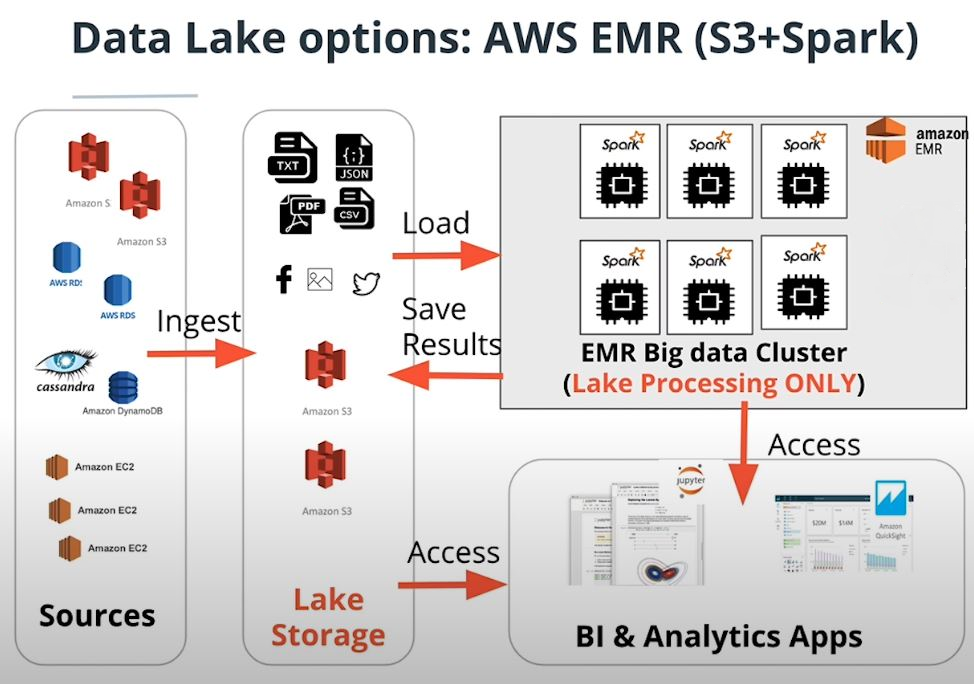

# DATA LAKE

## Introduction

A music streaming startup, Sparkify, has grown their user base and song database even more and want to move their data warehouse to a data lake. Their data resides in S3, in a directory of JSON logs on user activity on the app, as well as a directory with JSON metadata on the songs in their app.
## Project Description

As their data engineer, I'm tasked with building an ETL pipeline that extracts their data from S3, processes them using Spark, and loads the data back into S3 as a set of dimensional tables using AWS EMR. This will allow their analytics team to continue finding insights in what songs their users are listening to.

## Schema

#### Fact Table

1. **songplays** - records in log data associated with song plays i.e. records with page NextSong
songplay_id, start_time, user_id, level, song_id, artist_id, session_id, location, user_agent
#### Dimension Tables

2. **users** - users in the app
user_id, first_name, last_name, gender, level

3. **songs** - songs in music database
song_id, title, artist_id, year, duration

4. **artists** - artists in music database
artist_id, name, location, lattitude, longitude

5. **time** - timestamps of records in songplays broken down into specific units
start_time, hour, day, week, month, year, weekday

## Files

- **imgs** - Pictures used in the project

- **dl.cfg** - Configuration file

- **etl.py** - Code to execute project

- **README.md** - Project description 

## Project Execution
- Create AWS EMR Spark cluster

- Create S3 bucket output using AWS(input data in us-west-2)

- Update **dl.cfg** with credendtials and S3 output

- Submit **etl.py** to cluster(Can be achived via CLI as a step [docs](https://docs.aws.amazon.com/emr/latest/ReleaseGuide/emr-spark-submit-step.html))